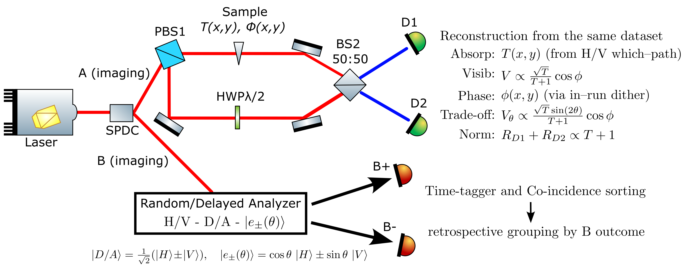
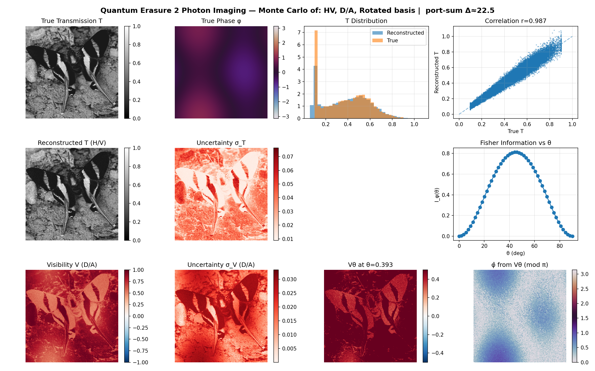
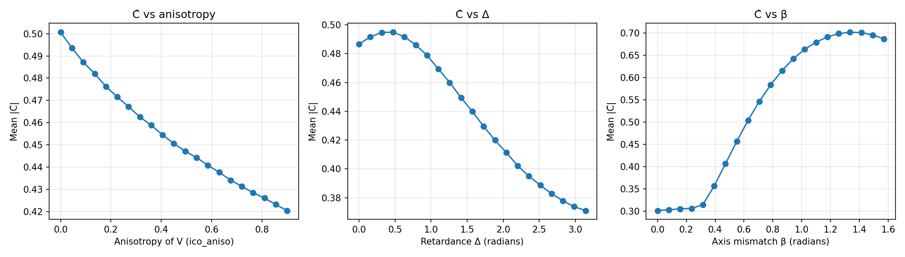

# Quantum Erasure Imaging – Code Companion

This repository accompanies the preprint **“Quantum Erasure Imaging:
Complementary Modalities and Indefinite Causal Order”**. The scripts
implement the Monte-Carlo studies, estimator checks, and indefinite
causal-order (ICO) visualizations discussed throughout the paper, so
readers can reproduce the figures, probe assumptions, or adapt the
pipeline to their own samples.

| Quantum-eraser imaging interferometer (Fig. 1 in the paper) |
| :--: |
|  |

## Repository Overview
- `quantum_eraser_imaging.pdf` – preprint for reference.
- `qei_monte_carlo_gpu.py` – end-to-end simulator used in the main text:
  builds synthetic samples, runs entangled-photon acquisitions in the
  H/V, D/A, and rotated bases, reconstructs absorption `T(x,y)` and
  phase `φ(x,y)`, and assembles the publication figure (Sec. II–IV).
- `make_ico_main_figure.py` – standalone generator for the quantum-switch
  “Jones microscope” figure. Mirrors the ICO imaging discussion in
  Sec. V by producing ground-truth operator maps, commutator-contrast
  reconstructions, and per-pixel shot-noise estimates from a single run.
- `generate_ico_curves.py` – sweeps ICO parameters (retardance Δ,
  diattenuation anisotropy, axis mismatch β) to reproduce the tuning
  curves cited in Sec. V and the supplemental discussion.
- `butterfly.jpg` – public-domain amplitude image bundled for demos.

## Requirements
- Python ≥ 3.9
- Core packages: `numpy`, `matplotlib`, `pillow`
- Optional GPU acceleration: `cupy` (installs require CUDA; the simulator
  auto-detects availability and falls back to NumPy)

Install dependencies (CPU path):

```bash
python3 -m venv .venv
source .venv/bin/activate
pip install numpy matplotlib pillow
# optional GPU acceleration
pip install cupy-cuda12x  # pick the wheel that matches your CUDA stack
```

## Quick Start
1. Activate your environment.
2. Run the main simulator to recreate the multi-panel figure from Sec. II–IV:
   ```bash
   python qei_monte_carlo_gpu.py --H 256 --W 256 --ppp 800 --save --save-prefix qei_demo
   ```
   This produces `qei_demo_main.png` (dual-modality reconstructions and
   estimator diagnostics). Add `--delta <radians>` to enable the global
   two-step phase retrieval panel, or `--ico` to append the ICO subplot.
3. Explore analyzer trade-offs or custom samples:
   - `--theta`: rotated analyzer angle used in the Fisher-information
     study (Fig. 2–4 discussion).
   - `--image` / `--phi-image`: drive `T(x,y)` or `φ(x,y)` with external
     grayscale/RGB assets.
   - `--gpu`: request CuPy if you have CUDA available.

## Featured Outputs
The repository ships with pre-generated figures built from the paper’s
smooth phase profile and the public-domain `butterfly.jpg` amplitude:

| QEI dual-modality figure (`butterfly_qei_main.png`) | ICO diagnostics (`butterfly_qei_ico_ico.png`) |
| :--: | :--: |
|  |  |

| ICO tuning curves (`butterfly_ico_curves.png`) |
| :--: |
|  |

Recreate or adapt them with:

```bash
# QEI only
python qei_monte_carlo_gpu.py --H 256 --W 256 --ppp 800 \
    --image butterfly.jpg --phi-mode smooth --nofig --save \
    --save-prefix butterfly_qei

# QEI + ICO companion panels
python qei_monte_carlo_gpu.py --H 256 --W 256 --ppp 800 \
    --image butterfly.jpg --phi-mode smooth --ico --nofig --save \
    --save-prefix butterfly_qei_ico

# ICO tuning curves (smaller grid for runtime)
python generate_ico_curves.py --H 128 --W 128 --ppp 1000 \
    --image butterfly.jpg --phi-mode smooth --out butterfly_ico_curves.png
```

## Reproducing ICO Results (Sec. V)
- **Main ICO figure** – single acquisition with commuting/non-commuting
  regions, commutator-contrast map, and binomial error bars:
  ```bash
  python make_ico_main_figure.py --H 256 --W 256 --N 800 --nu 0.95 --out ico_main.png
  ```
  The script reports the analyzer-independence check
  (`I_+ + I_-` spread) highlighted in the text and writes `ico_main.png`.

- **ICO tuning curves** – anisotropy, retardance, and axis mismatch sweeps:
  ```bash
  python generate_ico_curves.py --ppp 2000 --npoints 41 --csv ico_curves.csv
  ```
  This yields `ico_curves.png` (three subplots) and an optional CSV you
  can drop directly into the paper’s supplementary material.

## How the Scripts Map Onto the Paper
- **Sections II–IV (core QEI protocol)** – `qei_monte_carlo_gpu.py`
  implements the balanced two-port estimators, completeness/no-signaling
  checks, Fisher-information sweep, and global phase-step option for
  unwrapping `φ(x,y)` that are discussed around Eqs. (15)–(21) and
  illustrated in Figs. 2–4.
- **Section V (Quantum-Switch Jones Microscopy)** – `make_ico_main_figure.py`
  and `generate_ico_curves.py` realize the commutator-contrast
  reconstructions, analyzer-independence test, and the Δ/β/anisotropy
  scans that motivate Fig. 6 and the supplemental curves.
- **Supplementary explorations** – the simulator’s flags (`--ico-*`,
  `--phi-mode`, `--T-const`, etc.) let you vary sample geometry, input
  polarization, and witness weights exactly as described in the
  discussion of operational advantages and ICO witness evaluations.

## Extending the Companion Code
- Swap in your own amplitude/phase images (e.g., `--image sample.png`,
  `--phi-mode hue --phi-image texture.jpg`) to examine estimator
  behavior on realistic data.
- Adjust photon budget via `--ppp` (QEI) or `--N` (ICO) to match the shot
  noise levels analyzed in the CRB/Fisher-information section.
- Provide witness weights to `qei_monte_carlo_gpu.py --ico` via
  `--ico-witness-weights wD1+ wD2+ wD1- wD2-` to reproduce the causal
  nonseparability (CNS) certification described in Sec. V.

## Troubleshooting Tips
- When using `--gpu`, ensure the matching CuPy wheel for your CUDA toolkit
  is installed; otherwise the code prints a warning and runs on CPU.
- If Pillow cannot find an image asset, the loaders fall back to the
  smooth synthetic textures used in the paper’s baseline simulations.
- Random seeds are exposed (`--seed`) so you can reproduce the exact
  Monte-Carlo shots referenced in the manuscript.

Feel free to open issues or adapt the scripts for new samples—each module
is written to be readable, with docstrings pointing back to the relevant
equations in the paper.
